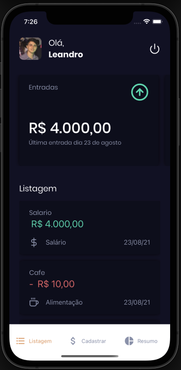
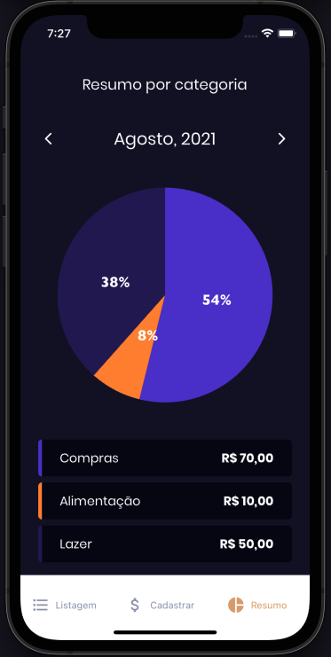

<h1 align="center">
    
</h1>

<p align="center">
   
   
   
  Typescript | Firebase
</p>

## :bookmark: About the project

- React Native - Expo application for the GoFinances project developed at Ignite @ Rocketseat.
  Application made to control your finances in a practical way, adding your receipts and expenses by category and even having an informative graphic of expenses by category.

## 🚀 Technologies

Technologies that I used to develop this mobile client

- [React Native](https://reactnative.dev/)
- [Styled Components](https://styled-components.com/)
- [Expo](https://expo.io/)
- [TypeScript](https://www.typescriptlang.org/)
- [React Navigation](https://reactnavigation.org/)
- [Google Fonts](https://fonts.google.com/)
- [Date-Fns](https://date-fns.org/)
- [React Hook Form](https://react-hook-form.com/)
- [Victory Native](https://formidable.com/open-source/victory/)
- [React-Native-Svg](https://www.npmjs.com/package/react-native-svg)
- Environment variables

## 💻 Getting started

### Requirements

**Clone the project and access the folder**

```bash
$ git clone https://github.com/leolivm/gofinances.git && cd gofinances
```

**Follow the steps below**

```bash
# Install the dependencies
$ yarn
```

Create an `.env` file in the project's root directory

Copy the variables from the `.env.example` file and paste into `.env`, now fill in the information with your Google Credentials

Run the project

```bash
$ expo start
```

---

Made with 💜 by Leandro Martins 👋 [See my linkedin](https://www.linkedin.com/in/leandro-martins-0640921a4/)
